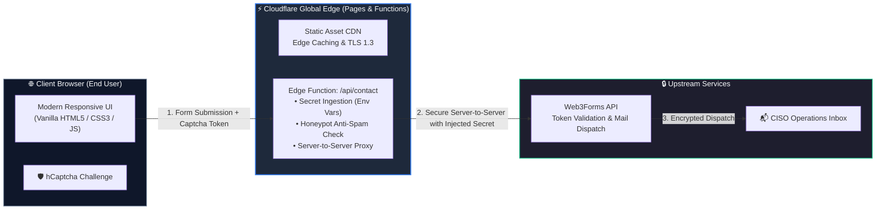

# 🛡️ CISO as a Service — Secure Serverless Platform & Landing Page

[](https://pages.cloudflare.com/)
[](https://developers.cloudflare.com/pages/functions/)
[]()
[]()
[]()

A high-performance landing page and lead-capture platform engineered for **Fractional CISO (Chief Information Security Officer) services**. Built for mid-market enterprises, manufacturing facilities (OT/ICS), and high-growth companies requiring executive cybersecurity governance, compliance certification (ISO 27001, SOC 2), and cyber insurance readiness.

The platform is designed with a **DevSecOps & Edge-First architecture**: strict secret isolation, zero client-side credential exposure, multi-tier bot mitigation, and serverless edge execution powered by Cloudflare Pages.

---

## 🏛️ System Architecture

Rather than exposing third-party API credentials in client-side JavaScript or provisioning dedicated backend servers, the application implements a **Backend-for-Frontend (BFF) Serverless Edge Proxy** deployed on **Cloudflare's global edge network**.



---

## 🔐 DevSecOps & Security Engineering Controls

| Security Control | Implementation | Operational / Security Benefit |
| :--- | :--- | :--- |
| **Zero Secret Exposure** | Upstream API keys are stored exclusively as encrypted environment secrets in Cloudflare Pages; zero credentials exist in Git or client bundles. | Eliminates supply-chain exposure, GitHub secret scanning alerts, and accidental credential leaks. |
| **BFF Edge Proxy Pattern** | Client browser communicates strictly with the internal relative endpoint (`/api/contact`). Third-party API keys are injected at the edge. | Prevents credential extraction via browser DevTools (F12), network sniffing, and API quota abuse. |
| **Dual-Tier Bot Mitigation** | Combines an interactive **hCaptcha** challenge (verified server-side) with an invisible **Honeypot trap** (`botcheck`). | Filters both naive automated scripts and distributed bot crawlers before triggering notification workflows. |
| **Zero-Dependency Supply Chain** | Built with pure semantic HTML5, modern CSS3, and Vanilla JavaScript — 0 npm packages, 0 build dependencies. | Eliminates package tampering, dependency confusion, and vulnerabilities (0 CVE footprint / No `npm audit` risks). |
| **Edge Resilience & DDoS Defense** | Terminated on Cloudflare’s global Anycast network with unmetered L3/L4/L7 DDoS mitigation and modern TLS 1.3. | 99.99% availability, hardened against network flooding, and ultra-low latency (<50ms TTFB). |

---

## ✨ Key Features

- **🎯 Executive-Focused Value Proposition**: Structured around concrete industrial and corporate cybersecurity challenges (client questionnaires, insurance mandates, OT/ICS operational security).
- **⚡ Zero Build Pipeline Overhead**: Blazing fast load times with static asset optimization; no bloated JavaScript framework runtimes.
- **📱 Responsive & Native Dark Mode**: Tailored dark cyber aesthetic, glassmorphism card surfaces, and full RTL (Right-to-Left) typography support for Hebrew.
- **🔄 GitOps Continuous Deployment**: Atomic, zero-downtime edge deployments triggered automatically on every `git push` via Cloudflare Pages.

---

## 📂 Project Structure

```text
├── functions/
│   └── api/
│       └── contact.js       # Cloudflare Pages Function (Secure Serverless Edge Proxy)
├── .gitignore               # Strict exclusion of secrets, dev files, and local artifacts
├── index.html               # Frontend application (UI, CSS tokens, hCaptcha, AJAX)
└── README.md                # Technical & architectural documentation
```

---

## 🛠️ Local Development & Testing

You can run and test both the static frontend and the serverless Edge Function locally using [Wrangler](https://developers.cloudflare.com/workers/wrangler/) (Cloudflare CLI):

1. **Configure local environment variables**:
   Create a local file named `.dev.vars` in the project root (this file is excluded by `.gitignore`):
   ```ini
   WEB3FORMS_ACCESS_KEY=your_test_access_key_here
   ```

2. **Start the local Cloudflare Pages server**:
   ```bash
   npx wrangler pages dev .
   ```

3. **Access the application**:
   Open `http://localhost:8788` in your browser. Both static assets and `/api/contact` will be executed in a local Cloudflare edge emulator.

---

## ⚙️ Production Deployment (Cloudflare Pages)

### 1. Prerequisites
- A [Cloudflare Account](https://dash.cloudflare.com/) (Free tier includes 100,000 edge function requests/day).
- A [Web3Forms](https://web3forms.com/) Access Key with **hCaptcha** enabled under *Spam & Security*.

### 2. GitOps Setup via Cloudflare Dashboard
1. Push this repository to **GitHub**.
2. In the Cloudflare Dashboard, go to: **Workers & Pages** ➔ **Create application** ➔ **Pages** ➔ **Connect to Git**.
3. Select your repository and apply the build configuration:
   - **Framework preset**: `None`
   - **Build command**: *(Leave empty)*
   - **Build output directory**: `.` *(Root)*
4. Under **Environment variables (Advanced)**, add your encrypted secret:
   - **Variable name**: `WEB3FORMS_ACCESS_KEY`
   - **Value**: `[Your-Web3Forms-Access-Key]`
   - Select **Encrypt** (Secret).
5. Click **Save and Deploy**. Your secure platform will be live within seconds with automated atomic deployments on future commits.

---

## 👨‍💻 Engineering Competencies Demonstrated

This project showcases practical implementation of modern **DevSecOps** and **Cloud/Edge Security** patterns:

- **Serverless & Edge Computing**: Leveraging Cloudflare Pages Functions (V8 isolates) for low-latency serverless request processing.
- **Secure API Architecture**: Designing Backend-for-Frontend (BFF) proxy boundaries to safeguard upstream services and credentials.
- **Zero-Trust Secret Handling**: Complete separation of code and configuration using encrypted runtime secrets.
- **Bot Mitigation & Anti-Abuse**: Multi-layered defense incorporating hCaptcha and honeypot field traps.
- **Attack Surface Minimization**: Eliminating software supply-chain risks through zero-dependency native engineering.

---

*Licensed under the [MIT License](LICENSE).*
