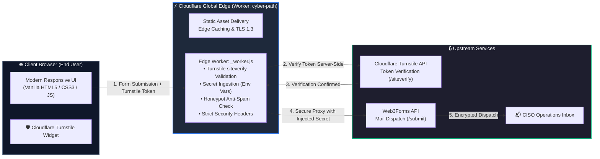

# 🛡️ CISO as a Service — Secure Serverless Platform & Landing Page

[](https://workers.cloudflare.com/)
[](https://developers.cloudflare.com/workers/)
[]()
[]()
[]()

A high-performance landing page and lead-capture platform engineered for **Fractional CISO (Chief Information Security Officer) services**. Built for mid-market enterprises, manufacturing facilities (OT/ICS), and high-growth companies requiring executive cybersecurity governance, compliance certification (ISO 27001, SOC 2), and cyber insurance readiness.

The platform is designed with a **DevSecOps & Edge-First architecture**: strict secret isolation, zero client-side credential exposure, multi-tier bot mitigation via Cloudflare Turnstile and honeypot traps, and serverless edge execution powered by Cloudflare Workers.

---

## 🏛️ System Architecture

Rather than exposing third-party API credentials in client-side JavaScript or provisioning dedicated backend servers, the application implements a **Backend-for-Frontend (BFF) Serverless Edge Proxy** deployed on **Cloudflare's global edge network**.



---

## 🔐 DevSecOps & Security Engineering Controls

| Security Control | Implementation | Operational / Security Benefit |
| :--- | :--- | :--- |
| **Zero Secret Exposure** | Upstream API keys are stored exclusively as encrypted environment secrets in Cloudflare; zero credentials exist in Git or client bundles. | Eliminates supply-chain exposure, GitHub secret scanning alerts, and accidental credential leaks. |
| **BFF Edge Proxy Pattern** | Client browser communicates strictly with the internal relative endpoint (`/api/contact`). Third-party API keys are injected at the edge. | Prevents credential extraction via browser DevTools (F12), network sniffing, and API quota abuse. |
| **Dual-Tier Bot Mitigation** | Combines seamless **Cloudflare Turnstile** verification (canonical server-side validation) with an invisible **Honeypot trap** (`botcheck`). | Eliminates intrusive CAPTCHAs for human users while blocking automated scrapers and distributed bots. |
| **Input Validation & Sanitization** | Strict payload boundary enforcement, length caps, and email regex checks in `_worker.js`. | Prevents payload injection, memory exhaustion, and server DoS. |
| **HTTP Security Headers** | Injects `X-Content-Type-Options`, `X-Frame-Options`, `Strict-Transport-Security`, `Referrer-Policy`, and CSP. | Hardens against clickjacking, MIME-sniffing, and unauthorized cross-origin framing. |
| **Zero-Dependency Supply Chain** | Built with pure semantic HTML5, modern CSS3, and Vanilla JavaScript — 0 npm packages, 0 build dependencies. | Eliminates package tampering, dependency confusion, and vulnerabilities (0 CVE footprint / No `npm audit` risks). |
| **Edge Resilience & DDoS Defense** | Terminated on Cloudflare’s global Anycast network with unmetered L3/L4/L7 DDoS mitigation and modern TLS 1.3. | Hardened against network flooding with ultra-low latency (<50ms TTFB). |

---

## ✨ Key Features

- **🎯 Executive-Focused Value Proposition**: Structured around concrete industrial and corporate cybersecurity challenges (client questionnaires, insurance mandates, OT/ICS operational security).
- **⚡ Zero Build Pipeline Overhead**: Blazing fast load times with static asset optimization; no bloated JavaScript framework runtimes.
- **📱 Responsive & Native Dark Mode**: Tailored dark cyber aesthetic, glassmorphism card surfaces, and full RTL (Right-to-Left) typography support for Hebrew.
- **🔄 GitOps Continuous Deployment**: Atomic, zero-downtime edge deployments triggered automatically on every `git push` via Cloudflare.

---

## 📂 Project Structure

```text
├── _worker.js               # Cloudflare Worker (BFF Proxy, Turnstile siteverify, Security Headers)
├── wrangler.json            # Cloudflare Worker configuration & Static Asset binding
├── index.html               # Frontend landing page (UI, CSS tokens, Turnstile, AJAX)
├── .assetsignore            # Strict exclusion rules for Cloudflare Static Asset CDN
├── .gitignore               # Strict exclusion of secrets, dev files, and local artifacts
└── README.md                # Technical & architectural documentation
```

---

## 🛠️ Local Development & Testing

You can run and test both the static frontend and the serverless Worker locally using [Wrangler](https://developers.cloudflare.com/workers/wrangler/) (Cloudflare CLI):

1. **Configure local environment variables**:
   Create a local file named `.dev.vars` in the project root (this file is excluded by `.gitignore`):
   ```ini
   WEB3FORMS_ACCESS_KEY=your_test_access_key_here
   TURNSTILE_SECRET_KEY=1x0000000000000000000000000000000AA
   ```

2. **Start the local Cloudflare Worker development server**:
   ```bash
   npx wrangler dev
   ```

3. **Access the application**:
   Open `http://localhost:8787` in your browser. Both static assets and `/api/contact` will execute inside the local Cloudflare Workerd runtime.

---

## ⚙️ Production Deployment (Cloudflare Workers)

### 1. Prerequisites
- A [Cloudflare Account](https://dash.cloudflare.com/).
- A [Web3Forms](https://web3forms.com/) Access Key.
- A [Cloudflare Turnstile](https://dash.cloudflare.com/?to=/:account/turnstile) Site Key & Secret Key.

### 2. Configure Cloudflare Secrets
Store the secrets securely using Wrangler CLI or via Cloudflare Dashboard:
```bash
npx wrangler secret put WEB3FORMS_ACCESS_KEY
npx wrangler secret put TURNSTILE_SECRET_KEY
```

### 3. Deploy
```bash
npx wrangler deploy
```

---

## 👨‍💻 Engineering Competencies Demonstrated

This project showcases practical implementation of modern **DevSecOps** and **Cloud/Edge Security** patterns:

- **Serverless & Edge Computing**: Leveraging Cloudflare Workers (V8 isolates) for low-latency serverless request processing.
- **Secure API Architecture**: Designing Backend-for-Frontend (BFF) proxy boundaries to safeguard upstream services and credentials.
- **Zero-Trust Secret Handling**: Complete separation of code and configuration using encrypted runtime secrets.
- **Bot Mitigation & Anti-Abuse**: Multi-layered defense incorporating Cloudflare Turnstile and honeypot field traps.
- **Attack Surface Minimization**: Eliminating software supply-chain risks through zero-dependency native engineering.
